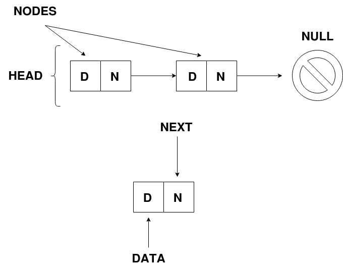

# Singly Linked List

**Diagram**

## Comparison With Array

* Insertion/Deletion: Array (O(n) | Singly Linked List (O(1)
* Access Elements: Array (O(1) | Singly Linked List (O(n)
* Contiguous Memory: Array (True) | Singly Linked List (False)
